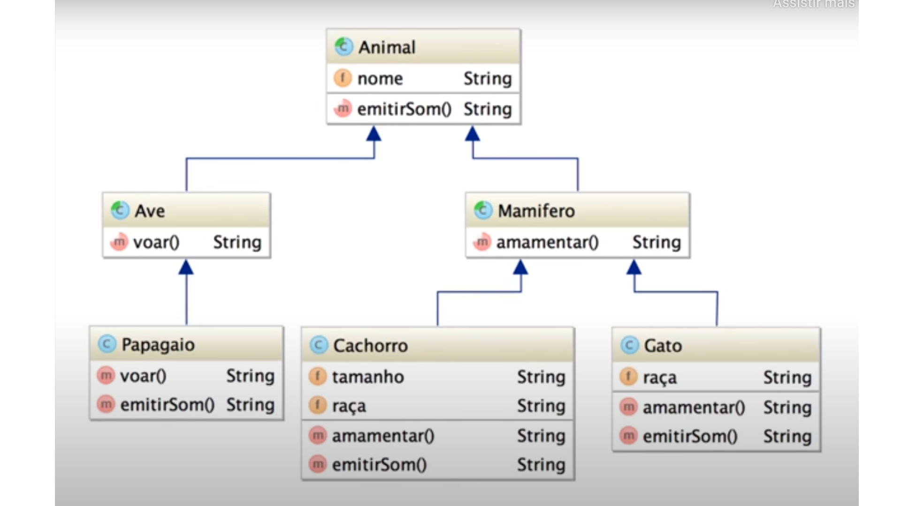

# CLASSES ABSTRATAS 

* O que é uma coisa abstrata?
    - Segundo  o Oxford Languages uma coisa abstrata é uma coisa que não é concreta.

* Mas o que isso tem a ver com programação?

* Vamos pegar os exemplos das classes Pessoa, Aluno e Professor:

* Lembrando que a classe Aluno e Professor, herdam as propriedades de Pessoa. No método  **main**, podemos fazer isso:

```java 

    Pessoa pessoa1 = new Pessoa();
    Professor professor1 = new Professor();
    Aluno aluno1 = new Aluno();
```

* Porém, muitas vezes queremos utilizar as superclasses apenas como classe a ser herdada.
* Em alguns projetos não faz sentido poder herdar a classe Pessoa.

* Exemplo:

*Fonte: Loiane Groiner*

* Para impedir que uma classe seja instanciada e sirva apenas como superclasse, utilizamos a o termo abstract. Ex.: 

```java 
    public abstract class Pessoa {
    }
```

* Ao fazermos isso, não será possível instanciar um objeto do tipo Pessoa, só poderemos instanciar objetos das classes filha.

.png)

## Atividade
* Faça o código que represente essa imagem:


* As classes Animal, Ave e Mamífero são abstratas.
* Após criar as classes, instancie os objetos do tipo Papagaio, Cachorro e Gato em um arquivo Testando.java e preencha as informações e chame os métodos dessas classes.
